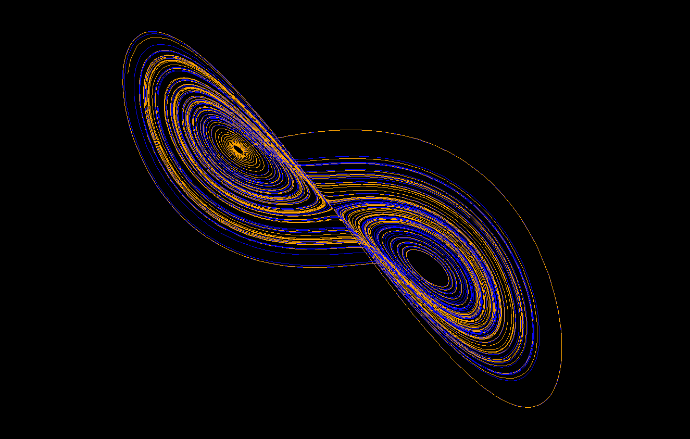

Lorenz Attractor Animation
==========================

By Andrew Kerr <kerrand@protonmail.com>



A simple implementation of the
[Lorenz Attractor](https://en.wikipedia.org/wiki/Lorenz_system).
Complete with a CLI that supports up to 5 simultaneous attractors and
sets of initial conditions.

Inspired by
[Quantitative Bytes](https://www.youtube.com/channel/UCiQVEoqrJNiVBWAcknaJLnQ),
and created with Pygame.

To run, first install pygame:

```
pip install pygame
```

Then download `lorenz.py` and run:

```
python3 lorenz.py
```
